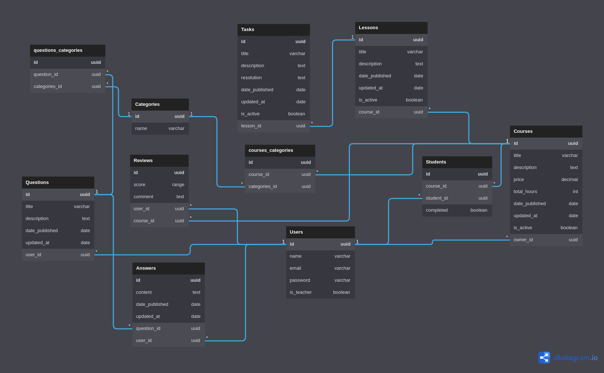

# Sobre

Avalanche cursos é uma plataforma que possibilita que qualquer pessoa possa criar seu curso, pois, todos são capazes de contribuir positivamente com algo para a sociedade.

## Funcionalidades da plataforma

A plataforma conta com um cadastro de usuários, onde que, o usuário pode escolher se será um fornecedor de cursos, um professor, ou um comprador, um estudante.
Sendo um professor o usuário poderá assim criar cursos, lições e tarefas de lições para esse mesmo, podendo incluir, ou não, vídeos, guias, gabaritos.
Sendo um estudante o usuário poderá conferir todos os cursos da plataforma e adquiri-los caso seja o queira.
A plataforma também conta com um sistema de fórum livre (para usuários) onde que se poderá realizar questionamentos, sejam eles relacionados aos tema dos cursos ou não, onde que qualquer outro usário poderá interagir.

# Tecnologias

Utilizamos do framework **Django** em conjuto ao **django-rest-framework** para a construção de uma API seguindo os padrões _REST_, ela também conta com o sistema de gerenciamento de banco de dados _SQL_, **PostgreSQL**, para se persistir o fluxo de dados. Também foi utilizado do **AWS S3** para o armanezamento de vídeos e do docker em conjunto ao docker-compose para auxílio no ambiente de desenvolvimento.

<a href="https://avalanche-cursos.herokuapp.com/api/docs/" alt="Swagger docs" target="_blank">

## Documentação das rotas com swagger

</a>

## Diagrama Entidade Relacionamento (DER)

